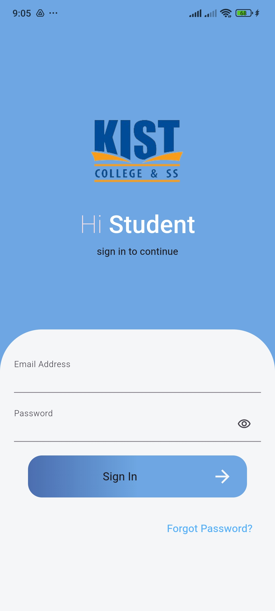
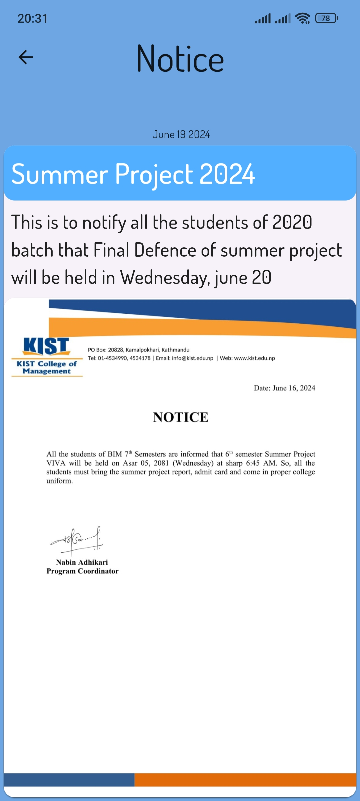
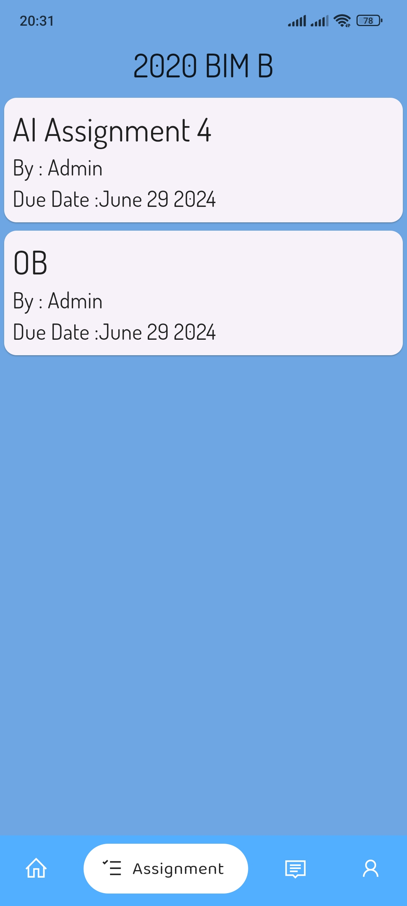
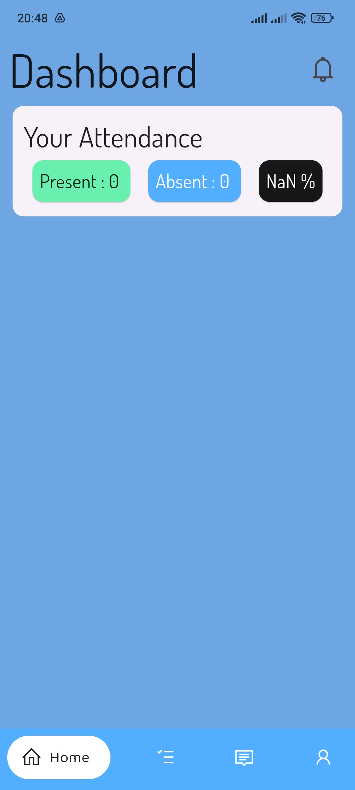
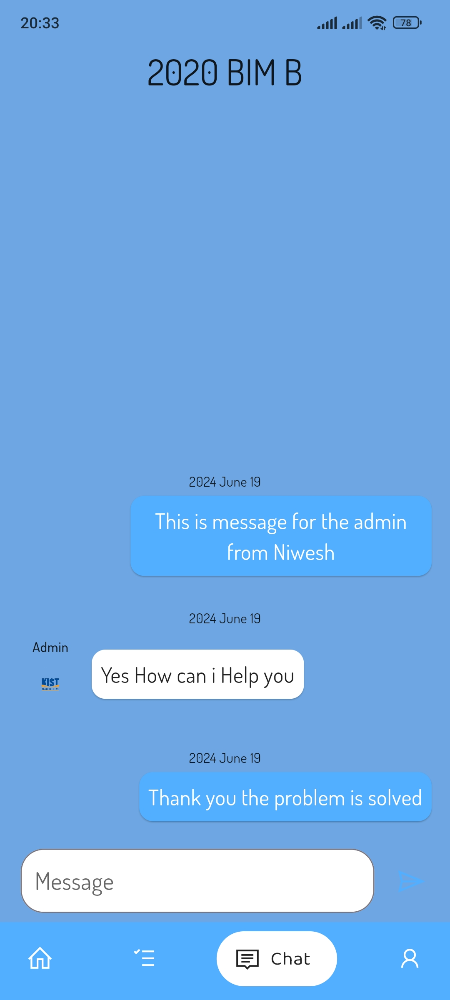

# Neuu KIST College Student Portal

A mobile application developed for KIST College, designed to enhance communication and provide essential academic features for students such as notices, assignments, attendance tracking, and a class chat system. This app aims to streamline communication between students and faculty while ensuring easy access to academic information in a user-friendly interface.

## Download the APK

You can download the APK of the KIST Student Portal app from the following link:

[Download APK](https://drive.google.com/drive/folders/1njECmFuuGcYPGmDJCERXH4HhmcLgZPo0?usp=drive_link)

## Features

- **Notices**: Get all college notices and updates in one place.
- **Assignments**: View and submit assignments with due dates and details.
- **Attendance Tracking**: Easily track your attendance for each subject.
- **Class Chat**: Connect with classmates and teachers via a dedicated chat feature.
- **Responsive Design**: Optimized for mobile devices, providing a seamless experience.

## Screenshots

Here are some screenshots of the app:







## Tech Stack

- **Frontend**: Flutter, Dart
- **Backend**: Firebase, Firestore
- **Authentication**: Firebase Authentication
- **Database**: Firestore (NoSQL database)
- **Cloud Functions**: Firebase Cloud Functions
- **UI/UX**: Material Design (Flutter)

## How to Use

1. Download the APK from the link above.
2. Install the APK on your Android device.
3. Log in using your student credentials provided by KIST College.
4. Access various features like notices, assignments, attendance tracking, and class chat.

## Installation

To install and run the app locally on your development machine, follow these steps:

1. Clone the repository:
   ```bash
   git clone https://github.com/yourusername/kist-student-portal.git

